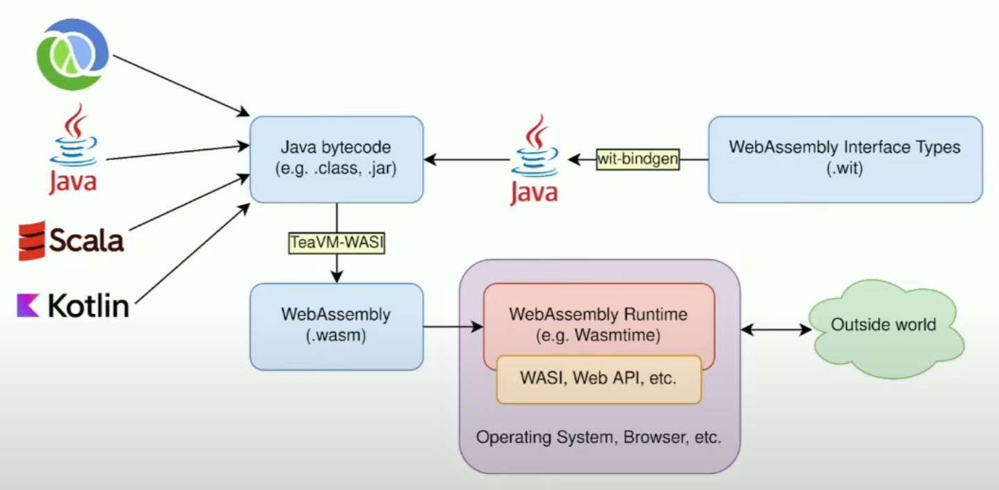

# Java WASM TeaVM

Exploring **WebAssembly** and testing in **Java** through **TeaVM**.


---

# Table of Contents

* [About the Project](#about-the-project)
* [What is WebAssembly](#what-is-webassembly-)
  * [Promise](#promise)
  * [WASM vs Docker](#wasm-vs-docker)
  * [Compilers](#compilers)
  * [Docker & Wasm](#docker--wasm)
  * [Performance](#performance)
  * [Usage](#usage)
  * [Examples](#examples)
  * [Conclusion](#conclusion)
* [Java - TeaVM](#java---teavm)
  * [Usage](#usage)
* [License](#license)

# About the Project

<table>
  <tr>
    <td>
        
    </td>
    <td>
        
    </td>
    <td>
        
    </td>
  </tr>
</table>

This is just to explore a bit about WebAssembly and specially in Java.

# What is WebAssembly ?

- **W3C** standard
- Presented in June 2015, released in March 2017, **W3C recommendation** since December 2019
- Binary instruction format (**bytecode**)
- Executable in a **virtual machine** (wasm runtime)
- **Portable** (not architecture or microprocessor dependent), x86 / ARM / RISC-V compatible
- **Secure** (runs in a sandbox, separate from the host runtime)
- **Compilable** from several languages (currently 40+ languages), C, C++, Rust, Go,
  and more recently Java, Kotlin, C#, Dart, Swift, Zig, ...
  and even interpreted languages such as PHP, Python or Ruby via interpreter compilation
- Executable in a **browser** (compatible with Firefox, Chrome, Safari, Opera, Edge since 2017) via Web APIs
- Executable on a server or in a **container** via [WASI](https://wasi.dev/)
  / [WasmEdge](https://github.com/WasmEdge/Wasmedge)
- **Lightweight** (small binaries), and **performance** close to native (> JavaScript)

## Promise

- Create binaries for the web from any language, executable anywhere
- Create libraries that can be used across multiple languages
- Create web applications that can use several languages on the same page

## WASM vs Docker

Quote from Solomon Hykes (co-founder of Docker) :

> If WASM+WASI existed in 2008, we wouldn't have needed to create Docker. That's how important it is. WebAssembly on the
> server is the future of computing

<div style="width:600px">


<div style="text-align:center; font-size: 10px; font-style: italic; margin-top:-15px;">

source : https://medium.com/@shivraj.jadhav82/webassembly-wasm-docker-vs-wasm-275e317324a1

</div>

</div>

WASM and Docker can be integrated via [Docker WASM](https://docs.docker.com/desktop/wasm/) (beta)
and/or [container2wasm](https://github.com/ktock/container2wasm).

Linux/Windows containers depend on the processor architecture and the operating system
(on Linux, you can only run Linux containers, and on Windows only Windows containers (or Linux, but
via a VM through Hyper-V)), this is not the case with WASM containers.

## Compilers

Programs must be compiled to obtain WebAssembly modules. For interpreted languages,
the interpreter is compiled into WebAssembly.

<div style="width:600px">


<div style="text-align:center; font-size: 10px; font-style: italic; margin-top:-15px;">

source : https://wasmlabs.dev/articles/docker-without-containers/

</div>

</div>

- For C / C++ (every language that uses **LLVM**) : `emscripten`

  ```shell
  sudo apt install emscripten
  emcc hello.c -o hello.html
  ```

- For Rust : `wasm-pack`

  ```shell
  cargo install wasm-pack
  wasm-pack build --target web
  ```

- For Flutter (Dart) : via `js_interop` package and flag `--wasm` (on browsers that support `WasmGC`)

  ```shell
  flutter build web --wasm
  ```

- For Go : Native since Go 1.11 via environment variables

  ```shell
  GOOS=js GOARCH=wasm go build -o main.wasm
  ```

- For Java : JVM bytecode to WebAssembly
  via [Bytecoder](https://mirkosertic.github.io/Bytecoder/), [TeaVM](https://www.teavm.org/)
  or [Cheerpj](https://cheerpj.com/)

  ```shell
  java -jar bytecoder-cli.jar -classpath=. -mainclass=Hello -builddirectory=. -backend=wasm 
  ```

## Docker & Wasm

### Wasm workloads

- Currently, you need to activate the feature in Docker Desktop

- Then specify the runtime and platform at runtime :

  ```shell
  docker run --runtime=io.containerd.wasmedge.v1 --platform=wasi/wasm mywasm
  ```

### Image to WASM via [container2wasm](https://github.com/ktock/container2wasm) :

Converting image to WASM, i.e. :

```shell
c2w ubuntu:22.04 /tmp/wasm/out.wasm
```

Running in a browser through Apache, i.e. :

```shell
c2w ubuntu:22.04 /tmp/out-js2/htdocs/out.wasm
cp -R ./examples/wasi-browser/* /tmp/out-js2/ && chmod 755 /tmp/out-js2/htdocs
docker run --rm -p 8080:80 \
         -v "/tmp/out-js2/htdocs:/usr/local/apache2/htdocs/:ro" \
         -v "/tmp/out-js2/xterm-pty.conf:/usr/local/apache2/conf/extra/xterm-pty.conf:ro" \
         --entrypoint=/bin/sh httpd -c 'echo "Include conf/extra/xterm-pty.conf" >> /usr/local/apache2/conf/httpd.conf && httpd-foreground'
```

## Performance

<div style="width:500px">


<div style="text-align:center; font-size: 10px; font-style: italic; margin-top:-15px;">

source : https://www.youtube.com/watch?v=MFruf7aqcbE

</div>

</div>

## Usage

_Statistics 2023_

<div style="width:500px">


<div style="text-align:center; font-size: 10px; font-style: italic; margin-top:-15px;">

source : https://web.developpez.com/actu/349740

</div>

</div>

<div style="width:500px">


<div style="text-align:center; font-size: 10px; font-style: italic; margin-top:-15px;">

source : https://web.developpez.com/actu/349740

</div>

</div>

Also used in various blockchains (Cosmos, Polkadot, MultiversX, Near Protocol) !

## Examples

Some WASM applications that run in the browser :

- C++ :

  - Google Earth : https://earth.google.com/web
  - Kunky Karts (jeu) : https://www.funkykarts.rocks/demo.html
  - Quake & Quake 2 : https://quake.m-h.org.uk/ & https://quake2.m-h.org.uk/

- PHP :

  - Wordpress : https://wordpress.wasmlabs.dev or https://playground.wordpress.net/
  - Drupal & more : https://seanmorris.github.io/php-wasm

- Kotlin :

  - JetSnack : https://zal.im/wasm/jetsnack/

- Go :

  - Chess (compilé via TinyGo) : https://marianogappa.github.io/cheesse-examples/)

- Rust :

  - Python interpreter : https://rustpython.github.io/demo/

- Linux :

  - Linux simple https://bellard.org/jslinux/vm.html?url=alpine-x86.cfg&mem=192
  - Linux simple with networking and C : https://ja.nsommer.dk/articles/linux-and-tiny-c-compiler-in-the-browser-part-one.html
  - Linux with Python sur RISC V : https://ktock.github.io/container2wasm-demo/riscv64-python.html
  - Linux with networking through Tailscale (and Python) : https://webvm.io/
  - Linux via CheerpX (with Python, Ruby, NodeJs, C++) : https://repl.leaningtech.com/?python3=

- Other tools :

  - JupyterLite : https://jupyterlite.github.io/demo

List of projects made with WebAssembly : https://madewithwebassembly.com/

## Conclusion

- Despite the promise of speed, the tools I've tried are pretty slow
- Most features are experimental, almost exclusively in preview or alpha versions
- The standard is incomplete and continues to evolve (rapidly though)
- Features such as the use of reflection require some tinkering
- Difficult to debug and profile (lack of tools)

Potential uses :

- Training, easily give users a ready-to-use environment (i.e. WordPress, Linux, Python, etc.)
- Testing new architectures, new distributions, etc.
- Libraries (shared across different systems / languages), even if TeaVM is not designed for this currently

# Java - TeaVM

Java bytecode compiler that emits JavaScript and/or WebAssembly to be executed in the browser.

- Does not require source code, only compiled files (not like GWT, for example)
- Also supports Kotlin and Scala

<div style="width:500px">



<div style="text-align:center; font-size: 10px; font-style: italic; margin-top:-15px;">

source : https://www.youtube.com/watch?v=MFruf7aqcbE

</div>

</div>

## Usage

Configuration is done via the Maven plugin `teavm-maven-plugin`, see [TeaVM](https://www.teavm.org/docs/tooling/maven.html).

Simply compile the project to generate the WASM and JS binaries (depending on the configuration).

Then simply launch the html files in _target/webapp/js_ or _target/webapp/wasm_.

# License

[General Public License (GPL) v3](https://www.gnu.org/licenses/gpl-3.0.en.html)

This program is free software: you can redistribute it and/or modify it under the terms of the GNU
General Public License as published by the Free Software Foundation, either version 3 of the
License, or (at your option) any later version.

This program is distributed in the hope that it will be useful, but WITHOUT ANY WARRANTY; without
even the implied warranty of MERCHANTABILITY or FITNESS FOR A PARTICULAR PURPOSE. See the GNU
General Public License for more details.

You should have received a copy of the GNU General Public License along with this program. If not,
see <http://www.gnu.org/licenses/>.
